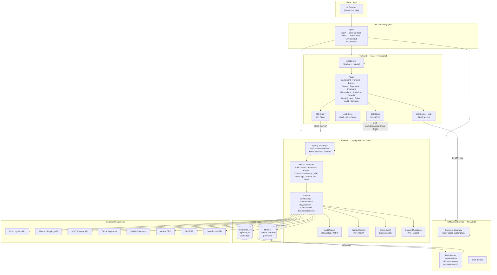
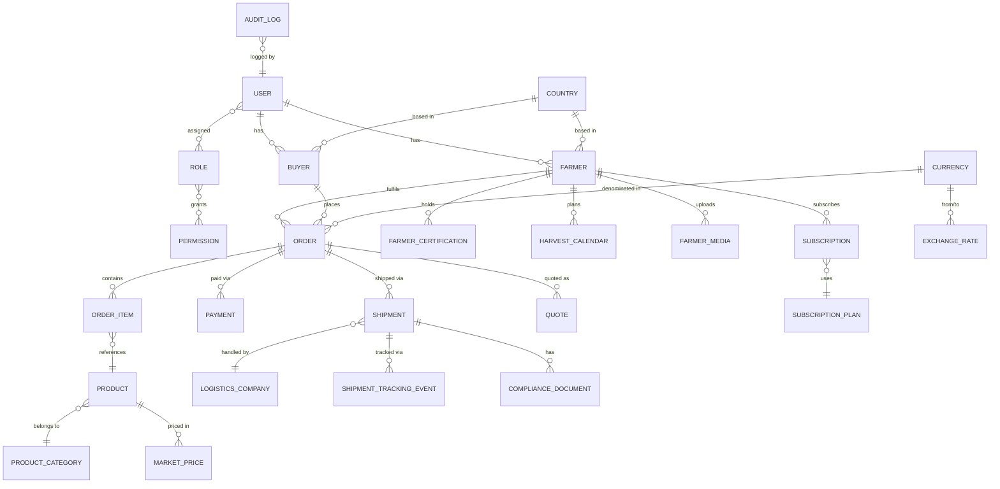

# 🌿 MST Agritech Platform

> **Zimbabwe's Global Agricultural Trade Platform** — connecting local farmers to international buyers for agricultural produce, flowers, and meat products.

---

## Architecture Overview



---

## Domain Model



---

## Tech Stack

| Layer | Technology |
|---|---|
| Frontend | React 19, TypeScript, Vite, Ant Design 5, Redux Toolkit, RTK Query |
| Backend | Spring Boot 3.2, Java 17, Spring Security 6 (JWT), Flyway, Jasper Reports |
| Notifications | NestJS 10, Socket.io, Bull, ioredis |
| Database | PostgreSQL 16 |
| Cache / Pub-Sub | Redis 7 |
| Container | Docker Compose |
| CI/CD (planned) | GitHub Actions |

---

## Running Locally

### Prerequisites
- Docker Desktop
- Node 20+
- Java 17+, Maven 3.9+

### 1 — Start infrastructure
```bash
docker compose up -d postgres redis pgadmin
```

### 2 — Start backend
```bash
docker compose up -d core-api
# Swagger UI → http://localhost:8080/swagger-ui.html
```

### 3 — Start notification service
```bash
cd backend/notification-service
npm install
npm run start:dev
# Health → http://localhost:3001/health
```

### 4 — Start frontend dev server
```bash
cd frontend
npm install
npm run dev
# App → http://localhost:5173
```

### Default dev credentials (no backend required)
| Role | Button on Login Page |
|---|---|
| Admin | **Login as Admin** |
| Normal User | **Login as Normal User** |

You can also switch roles at any time via the user menu in the top-right corner.

---

## Project Structure

```
mst-agritech/
├── frontend/                  # React + Vite SPA
│   └── src/
│       ├── features/auth/     # Login, auth slice, RequireAuth guard
│       ├── layouts/           # AppLayout (sidebar + header)
│       ├── pages/             # 17 feature pages + admin sub-pages
│       ├── app/               # Redux store + RTK Query apiSlice
│       └── hooks/             # useSSE, useWebSocket
├── backend/
│   ├── core-api/              # Spring Boot REST API (Maven)
│   │   └── src/main/java/com/mst/agritech/
│   │       ├── controller/    # 9 REST controllers
│   │       ├── service/       # Business logic
│   │       ├── domain/entity/ # 27 JPA entities
│   │       ├── repository/    # Spring Data JPA repos
│   │       ├── security/      # JWT filter, UserDetailsService
│   │       ├── config/        # Security, OpenAPI, WebSocket config
│   │       ├── audit/         # AOP audit logging
│   │       └── exception/     # Global exception handler
│   └── notification-service/  # NestJS real-time service
└── docker-compose.yml
```

---

## API Endpoints

| Method | Path | Access |
|---|---|---|
| POST | `/api/v1/auth/login` | Public |
| POST | `/api/v1/auth/register` | Public |
| GET | `/api/v1/dashboard/kpis` | Authenticated |
| GET | `/api/v1/dashboard/kpis/stream` | Authenticated (SSE) |
| GET/PATCH | `/api/v1/farmers` | Authenticated |
| GET/PATCH | `/api/v1/buyers` | Authenticated |
| GET/PATCH | `/api/v1/orders` | Authenticated |
| GET/PATCH | `/api/v1/users` | ADMIN |
| GET | `/api/v1/roles` | ADMIN |
| GET | `/api/v1/audit-logs` | ADMIN |
| GET | `/api/v1/master-data/countries` | Authenticated |
| GET | `/api/v1/master-data/currencies` | Authenticated |
| GET | `/api/v1/master-data/product-categories` | Authenticated |

Full interactive docs at **http://localhost:8080/swagger-ui.html** when running locally.

---

## Collaborators

| Name | GitHub |
|---|---|
| Joseph Muchengeti | [@josephmuchie](https://github.com/josephmuchie) |

